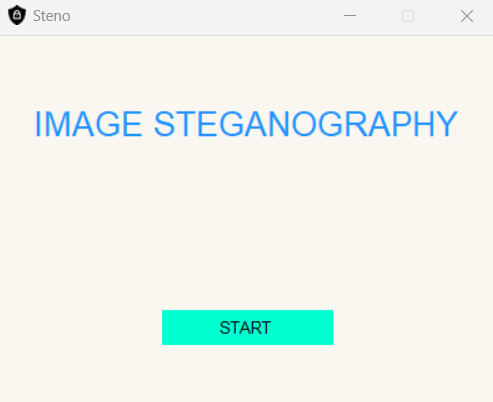

# Image-steganography

Image Steganography hides data within an image. It involves encoding (hiding a message in an image) and decoding (extracting the message). This project can be implemented using Python libraries like PIL and Tkinter.


## Deployment

To deploy this project run

```bash
  Open the folder on VScode or any editor and run the main.py file
```
instal tkinter

```bash
pip install tk
```
just open the main.py and run

## Screenshots



Screenshots are in the Screenshots folder 

